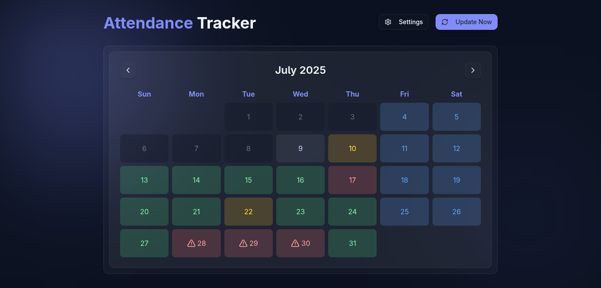
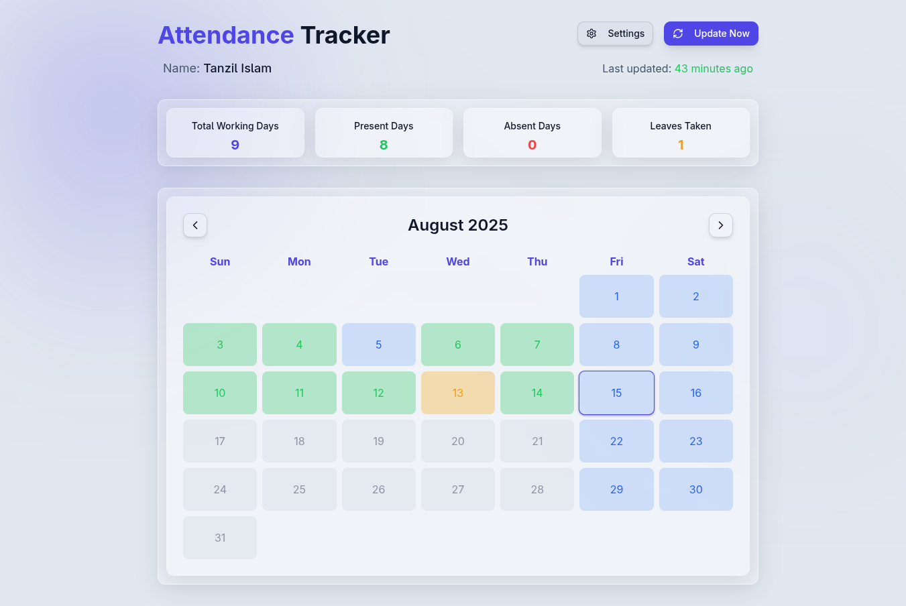

# College Attendance Tracker

A full-stack Next.js application designed to automatically scrape, display, and manage college attendance data. It provides a user-friendly, responsive interface to view attendance statistics, manage credentials, and configure holidays.

## Project Idea

One of the policies at our college is that if a student is absent for more than two days in a month, their student ID is automatically deactivated. However, a major limitation is that there is no way to view which specific days were marked as absent—only the total number of present, absent, and leave days for the entire academic year is shown on the college website.

This lack of visibility can be problematic. At times, I might forget to punch my ID card, or even question whether it was recorded properly.

This led me to the idea of building a personal project—an application that automatically tracks my daily attendance and visualizes the data in a calendar format. Also, since I hadn’t yet contributed under the “Vibe Coding” initiative, I figured this was a good opportunity to get started—and to test whether our junior co-programmer would really step up to the task.

I quickly drafted a rough concept in about 20–30 minutes and used AI to flesh out the details. Step by step, I started feeding instructions—not to a computer this time, but to an AI assistant. Within just a couple of hours, an alpha version of the app was up and running.

After a months of usage, the outcome has been very promising.

## Screenshots

<div align="center">
  
  <p><em>Main Dashboard with Monthly Statistics and Interactive Calendar</em></p>
  
  
  <p><em>Setting page with credential and holiday management</em></p>
</div>

## Key Features

- 🔐 **Automated Login & Data Scraping**: Automatically logs into the college website and fetches daily attendance data without manual intervention
- 🧩 **Auto-Refresh on Startup**: Automatically refreshes data when the computer starts up, eliminating the need for daily manual updates
- 📆 **Interactive Calendar Visualization**: Beautiful calendar interface showing daily status — Present, Absent, Leave, Error, or Holiday with color-coded indicators
- 📊 **Monthly Statistics Dashboard**: Clear overview of total absent, present, and leave counts for each month, excluding holidays and errors
- 🎯 **Customizable Settings**: Set custom holidays and configure college website credentials from the Settings page, making it usable by anyone
- 🗄️ **Local Data Storage**: All data is stored locally for maximum security and privacy
- 🚨 **Comprehensive Error Handling**: Detailed error tracking and reporting when scraping fails (network issues, invalid credentials, etc.)
- ⏰ **Smart Timing Logic**: Intelligent auto-fetch that only runs after 10 AM to ensure fresh daily data
- � **Fully Responsive Design**: Works seamlessly on both mobile and desktop devices
- 🏖️ **Holiday Management**: Add and remove custom named holidays that are excluded from attendance calculations
- 🔄 **Real-time Status Updates**: Live progress tracking during data scraping with detailed status messages

## Tech Stack

- **Framework**: [Next.js](https://nextjs.org/)
- **UI Library**: [React](https://reactjs.org/)
- **Styling**: [Tailwind CSS](https://tailwindcss.com/)
- **Web Scraping**: [Puppeteer](https://pptr.dev/)
- **Language**: JavaScript/Node.js

## Setup and Installation

### Prerequisites

Before setting up the College Attendance Tracker, make sure you have **Node.js** installed on your system.

**Download and Install Node.js:**
1. Visit [https://nodejs.org/](https://nodejs.org/)
2. Download the LTS (Long Term Support) version
3. Run the installer and follow the installation wizard
4. Verify installation by opening Command Prompt and running:
   ```bash
   node --version
   npm --version
   ```

### Windows Setup (Recommended)

**1. Download or Clone the Project:**
```bash
git clone <repository-url>
cd college-attendance-dev
```

**2. Run Setup (One-time installation):**
```batch
# Double-click this file or run in Command Prompt
setup.bat
```
This will:
- Install all required dependencies (`npm install`)
- Create necessary data files and folders
- Build the production version of the application
- Set up the project structure

**3. Start the Application:**
```batch
# Double-click this file or run in Command Prompt
start.bat
```
This will:
- Start the web application on `http://localhost:4040`
- Keep the application running until you close the window

**4. Configure Your Credentials:**
- Open your browser and go to `http://localhost:4040`
- Click on "Settings" in the top right
- Enter your college website username and password
- Configure any custom holidays if needed

### Optional: Automatic Startup (Windows)

If you want the application to **automatically start and scrape data in the background** every time your computer boots up:

**Run Auto-Setup (One-time configuration):**
```batch
# Double-click this file or run in Command Prompt
auto.bat
```

This will:
- ✅ Configure automatic startup on Windows boot
- ✅ Start the web application automatically in background
- ✅ Run attendance scraper every 3 hours automatically
- ✅ Work completely in the background
- ✅ Continue running until computer shutdown

**After running `auto.bat` once:**
- Restart your computer to test automatic startup
- The application will be available at `http://localhost:4040`
- Attendance data will be scraped automatically every 3 hours
- Everything runs silently in the background

**To remove automatic startup:**
```batch
auto.bat uninstall
```

### Manual Setup (Advanced Users)

**1. Clone the repository:**

```bash
git clone <repository-url>
cd college-attendance-dev
```

**2. Install dependencies:**

```bash
npm install
```

**3. Set up data files:**
The application uses local JSON files for data persistence. Create a `data` directory in the project root and add the following files:

- `config.json`: Stores login credentials and user preferences.
  ```json
  { "username": "YOUR_USERNAME", "password": "YOUR_PASSWORD", "calendarOnly": false, "notifications": true }
  ```
- `holidays.json`: Stores custom holidays with names.
  ```json
  []
  ```
- `attendance.json`: Stores scraped attendance data (initially empty).
  ```json
  []
  ```
- `scrape-status.json`: Stores scraper status information.
  ```json
  { "lastRun": "", "status": "idle", "progress": 0 }
  ```

**4. Build the application:**

```bash
npm run build
```

**5. Run the production server:**

```bash
npm run start
```

Open [http://localhost:3000](http://localhost:3000) with your browser to see the application.

## Usage

### First Time Setup
1. **Run Setup**: Double-click `setup.bat` (Windows) or follow manual setup instructions
2. **Start Application**: Double-click `start.bat` or run `npm run start`
3. **Configure Credentials**: Go to Settings page and enter your college login details
4. **Add Holidays**: Add any custom holidays that should be excluded from attendance calculations

### Daily Usage
- **Manual Mode**: Start the application with `start.bat` when needed
- **Automatic Mode**: Set up with `auto.bat` for hands-free operation

### Scraper Behavior
- Automatically runs after 10 AM to ensure fresh daily data
- Updates existing entries if run multiple times in a day
- Shows detailed progress and error information

## File Structure

```
college-attendance-dev/
├── setup.bat              # Windows setup script (run once)
├── start.bat               # Start application manually
├── auto.bat                # Configure automatic startup (optional)
├── components/             # React components
├── pages/                  # Next.js pages and API routes
├── scripts/                # Automation scripts
├── data/                   # Local data storage
│   ├── attendance.json     # Attendance records
│   ├── config.json         # User settings
│   ├── holidays.json       # Custom holidays
│   └── scrape-status.json  # Scraper status
└── docs/                   # Documentation and screenshots
```


