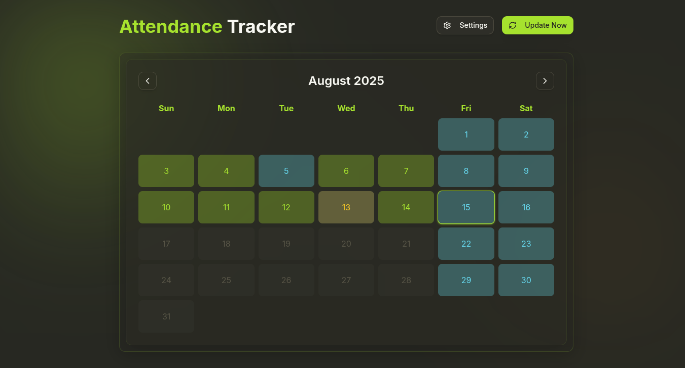
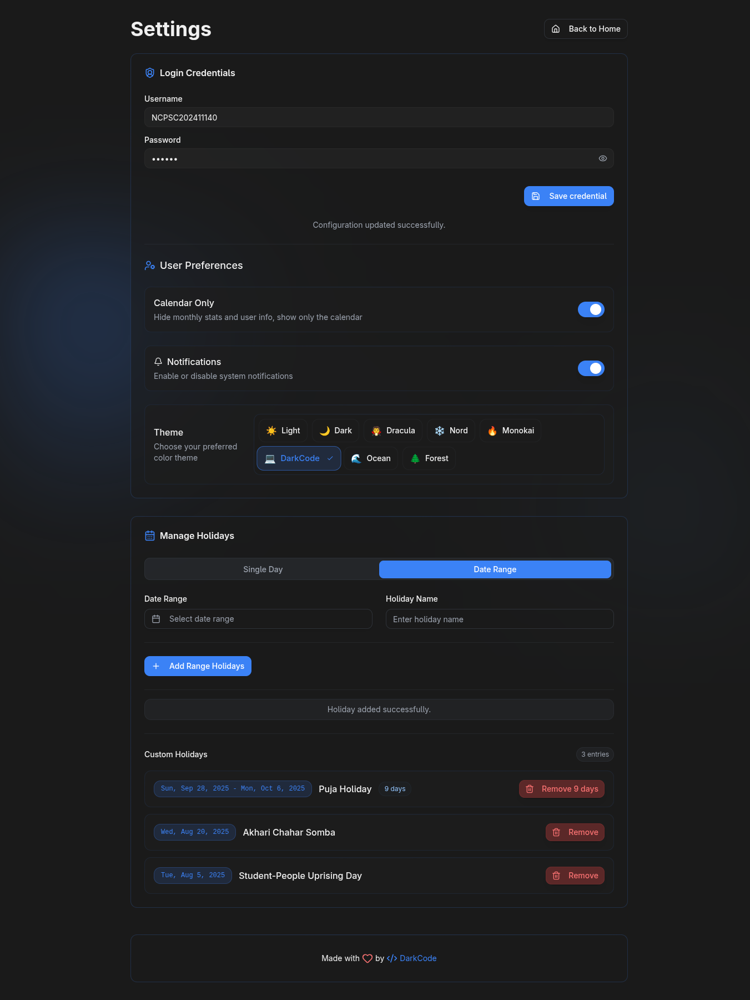

# Attendance Tracker v1.0

A beautiful, feature-rich Next.js application for automated attendance tracking with modern UI and multiple customizable themes.

## 📋 Table of Contents

- [✨ Key Features](#-key-features)
- [📸 Screenshots](#-screenshots)
- [💡 Project Idea](#-project-idea)
- [🚀 What's New in v1.0](#-whats-new-in-v10)
- [🛠️ Tech Stack](#️-tech-stack)
- [📥 Installation](#-installation)
  - [Prerequisites](#prerequisites)
  - [Quick Setup (Windows)](#quick-setup-windows)
  - [Auto-Startup (Optional)](#auto-startup-optional)
  - [Manual Setup (Advanced)](#manual-setup-advanced)
- [🚀 Usage](#-usage)
  - [First Time Setup](#first-time-setup)
  - [Daily Usage](#daily-usage)
- [📁 File Structure](#-file-structure)
- [🏢 Customization for Different Institutions](#-customization-for-different-institutions)
- [🤝 Contributing](#-contributing)

## ✨ Key Features

- 🔐 **Automated Login & Data Scraping**: Automatically logs into the website and fetches daily attendance data without manual intervention
- 🔄 **Auto-Refresh on Startup**: Automatically refreshes data when the computer starts up, eliminating the need for daily manual updates
- 📅 **Interactive Calendar Visualization**: Beautiful calendar interface showing daily status — Present, Absent, Leave, Error, or Holiday with color-coded indicators
- 📊 **Monthly Statistics Dashboard**: Clear overview of total absent, present, and leave counts for each month, excluding holidays and errors
- ⚙️ **Customizable Settings**: Set custom holidays and configure website credentials from the Settings page, making it usable by anyone
- 🔔 **Desktop Notifications**: System notifications for important updates and status changes
- 🗄️ **Local Data Storage**: All data is stored locally for maximum security and privacy
- 🚨 **Comprehensive Error Handling**: Detailed error tracking and reporting when scraping fails (network issues, invalid credentials, etc.)
- 🏖️ **Holiday Management**: Add and remove custom named holidays that are excluded from attendance calculations
- 🎨 **8 Beautiful Themes**: Light, Dark, Dracula, Nord, Monokai, DarkCode, Ocean, and Forest themes with modern sleek design

## 📸 Screenshots

<div align="center">
  
  <p><em>Dark Theme - Main Dashboard with Monthly Statistics and Interactive Calendar</em></p>
  
  
  <p><em>Light Theme - Clean and Modern Interface</em></p>

  
  <p><em>Custom Theme - One of 8 Available Themes</em></p>
  
  
  <p><em>Settings Page - Credential Management, Holiday Setup, and Theme Selection</em></p>
</div>

## 💡 Project Idea

Our college has a policy: if a student is absent for more than two days in a month, their student ID gets automatically deactivated. However, there's a major limitation - the college website only shows total counts of present, absent, and leave days for the entire academic year, without revealing which specific days were marked as absent.

This lack of visibility became problematic. I often forgot to punch my ID card or questioned whether it was recorded properly.

The solution? Build a personal attendance tracker that automatically monitors daily attendance and visualizes it in a calendar format. What started as a 30-minute concept drafted with AI assistance evolved into a full-featured application within hours.

After months of usage and continuous improvements, it has become a comprehensive attendance management system that helps students stay on top of their attendance records with beautiful visualizations and smart automation.

## 🚀 What's New in v1.0

- **Shadcn/ui:** Migrated to shadcn/ui component library
- **Themes:** Added modern design system with backdrop blur effects and 8 more themes
- **Date Range Selection**: Add multiple consecutive days as holidays in one action
- **Visual Calendar Picker**: Intuitive date selection with calendar interface
- **Desktop Notifications**: System notifications for attendance updates
- **User Control**: Easy customization in settings
- **Data Validation**: Enhanced input validation throughout the application
- **Performance Optimization**: Faster rendering and smoother interactions
- **Bug Fixes**: Resolved date calculation issues in holiday range selection

## 🛠️ Tech Stack

- **Framework**: [Next.js](https://nextjs.org/) - React-based full-stack framework
- **UI Library**: [React](https://reactjs.org/) - Modern component-based UI
- **Styling**: [Tailwind CSS v4](https://tailwindcss.com/) - Utility-first CSS framework with custom properties
- **Component Library**: [shadcn/ui](https://ui.shadcn.com/) - Modern, accessible React components
- **Web Scraping**: [Puppeteer](https://pptr.dev/) - Headless Chrome automation
- **Icons**: [Lucide React](https://lucide.dev/) - Beautiful, customizable icons
- **Language**: JavaScript/Node.js - Full-stack JavaScript development

## 📥 Installation

### Prerequisites

Make sure you have **Node.js** installed on your system:

1. Visit [https://nodejs.org/](https://nodejs.org/)
2. Download the LTS version and install it
3. Verify installation: `node --version` and `npm --version`

## Quick Setup (Windows)

**1. Download the Project:**

- Go to the GitHub repository
- Click the green **"Code"** button on the top right
- Select **"Download ZIP"**
- Extract the ZIP file to your desired location (e.g., `C:\attendance-tracker`)

**2. One-Click Setup:**

```batch
# Double-click on setup.bat
setup.bat
```

- Installs dependencies in order to run this application
- Initializes data files
- Builds project with an optimized production version

**3. Start the Application:**

```batch
# Double-click start.bat
start.bat
```

- Opens the app at `http://localhost:4040`
- Keeps running until you close the window

**4. Configure Settings:**

- Go to `http://localhost:4040` in your browser
- Click "Settings" → Enter your college credentials
- Add holidays if needed
- Choose your favorite theme!

### Auto-Startup (Optional)

For automatic background operation:

```batch
# Double-click auto.bat (one-time setup)
auto.bat
```

- Starts automatically on Windows boot
- Runs silently in background
- Auto-scrapes data every 3 hours
- Access anytime at `http://localhost:4040`

### Manual Setup (Advanced)

<details>
<summary>Click to expand manual installation steps</summary>

1. **Download & Extract**: Download ZIP file and extract
2. **Install Dependencies**: `npm install`
3. **Create Data Files**:
   ```bash
   mkdir data
   echo {} > data/config.json
   echo [] > data/attendance.json
   echo [] > data/holidays.json
   echo {} > data/scrape-status.json
   ```
4. **Build**: `npm run build`
5. **Start**: `npm run start`
6. **Access**: Open `http://localhost:3000`

</details>

## 🚀 Usage

### First Time Setup

1. **Download & Setup**: Download ZIP → Run `setup.bat` → Run `start.bat`
2. **Configure**: Open `http://localhost:4040` → Go to Settings
3. **Enter Credentials**: Add your college login details
4. **Customize**: Choose theme, add holidays, set preferences

### Daily Usage

- **Manual**: Double-click `start.bat` when needed
- **Auto**: Run `auto.bat` once for hands-free operation
- **Access**: Always available at `http://localhost:4040`

## 📁 File Structure

```
attendance-tracker/
├── 🔧 Setup Files
│   ├── setup.bat              # Windows setup script (run once)
│   ├── start.bat               # Start application manually
│   ├── auto.bat                # Configure automatic startup (optional)
│   └── next.config.js          # Next.js configuration
│
├── 🎨 UI Components
│   ├── components/
│   │   ├── Calendar.js         # Interactive calendar component
│   │   ├── MonthlyStats.js     # Monthly statistics display
│   │   ├── HolidayManager.js   # Holiday management interface
│   │   ├── Footer.js           # Shared footer component
│   │   └── ui/                 # shadcn/ui components
│   │       ├── button.jsx      # Custom button component
│   │       ├── calendar.jsx    # Calendar picker component
│   │       ├── card.jsx        # Card container component
│   │       ├── input.jsx       # Input field component
│   │       ├── theme-toggle.jsx # Theme selection component
│   │       └── ... (more UI components)
│   │
├── 📄 Pages & API
│   ├── pages/
│   │   ├── index.js            # Main home page with calendar
│   │   ├── settings.js         # Settings and configuration page
│   │   ├── _app.js             # App wrapper with theme provider
│   │   ├── _document.js        # Document with theme initialization
│   │   └── api/                # Backend API routes
│   │       ├── attendance.js   # Attendance data endpoints
│   │       ├── config.js       # Configuration management endpoints
│   │       ├── holidays.js     # Holiday management endpoints
│   │       ├── scrape.js       # Scraping trigger endpoints
│   │       └── scrape-status.js # Scraping progress tracking endpoints
│   │
├── 🎭 Styling & Themes
│   ├── styles/
│   │   └── globals.css         # Global styles with 8 theme definitions
│   ├── lib/
│   │   ├── theme-context.js    # Theme management context
│   │   ├── utils.js            # Utility functions
│   │   └── scraper.js          # Web scraping logic (MAIN SCRAPER FILE)
│   │
├── 📊 Data Storage
│   ├── data/                   # Local JSON data files
│   │   ├── attendance.json     # Daily attendance records
│   │   ├── config.json         # User credentials & preferences
│   │   ├── holidays.json       # Custom holidays with date ranges
│   │   └── scrape-status.json  # Real-time scraping progress
│   │
├── 🤖 Automation
│   ├── scripts/
│   │   └── run-scraper.js      # Automated scraping script
│   │
└── 📸 Documentation
    └── docs/                   # Screenshots and documentation
        ├── 1.png               # Dark theme dashboard
        ├── 2.png               # Light theme interface
        ├── 3.png               # Alternative theme example
        └── 4.png               # Settings page
```

## 🏢 Customization for Different Institutions

**Want to use this for your office/institution/college?**

You just need to update the `pages/api/scrape.js` file and adjust the scraping logic to work with your institution's website. The scraper uses Puppeteer to automate login and data extraction - simply modify the selectors and navigation logic to match your portal's structure.

All other features (calendar visualization, holiday management, themes, notifications) will work seamlessly with your customized scraper!

## 🤝 Contributing

This project welcomes contributions! Whether it's bug fixes, feature additions, or theme improvements, feel free to:

1. Fork the repository
2. Create a feature branch
3. Make your changes
4. Submit a pull request
